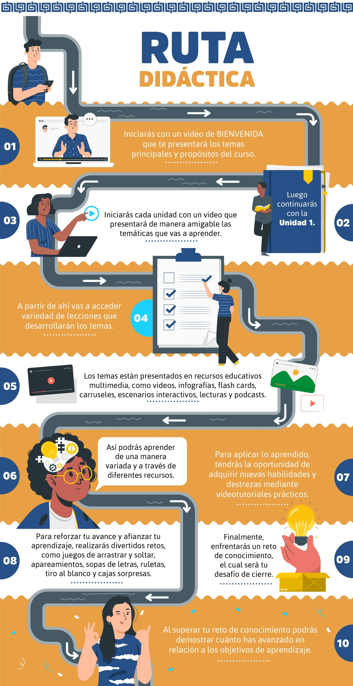

# Presentacion Curso Analitica de datos

## Bienvenida

Ver video 1_Bienvenida

## Objetivo del curso

Aplicar técnicas de análisis exploratorio de datos con métodos estadísticos y herramientas para extraer información que
propenda por el desarrollo de diferentes contextos laborales, como el ámbito empresarial, la salud, la industria financiera
y el sector público.

## Ruta didactica

## Cómo navegar el curso

Ver video 2_Cómo navegar el curso
