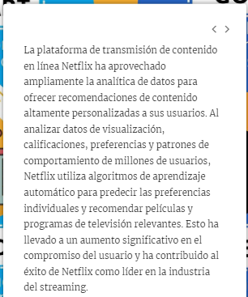
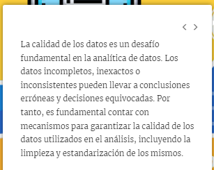

# Fundamentos

- Áreas de competencia: Búsqueda y Gestión de Información y Datos.
- Habilidad: Identificar datos, información y contenidos digitales.

## Bienvenida

Ver Video 1_Bienvenida

## ¿Qué es la analítica de datos?

Ver Video 2_¿Qué es la analítica de datos?

## Historia de la analítica de datos

## El Big Bang de la analítica

## Importancia de la analítica de datos

Ver pdf 5_Importancia de la analítica de datos

## Tipos de análisis de datos

Ver video 6_Tipo de analisis de datos

## ¿Qué hace un analista de datos?

Ver pdf 7_¿Qué hace un analista de datos?

## El analista de datos

## Aplicaciones de la analítica de datos en diferentes industrias

ver video 9_Aplicaciones de la analítica de datos en diferentes industrias

## Cómo las grandes empresas usan la analítica de datos

## Beneficios y desafíos de la analítica de datos

Ver video 11_Beneficios y desafíos de la analítica de datos

## Desafíos de la Analítica de Datos

## Herramientas y tecnologías utilizadas en la analítica de datos

ver video 13_Herramientas y tecnologías utilizadas en la analítica de datos

## Herramientas de extracción y transformación de datos

ver video 14_Herramientas de extracción y transformación de datos

## Herramientas de business analitycs and business intelligent

## Herramientas de análisis de grandes volúmenes de datos

## Técnicas avanzadas para el análisis de datos

## Etapas del proceso de análisis de datos

## Cómo implementar el proceso de análisis de datos en una empresa

## Errores al implementar incorrectamente los procesos

## Empresas data driven

## Madurez de las empresas respecto a los datos

## Herramientas para la analítica de datos

## Datos curiosos
