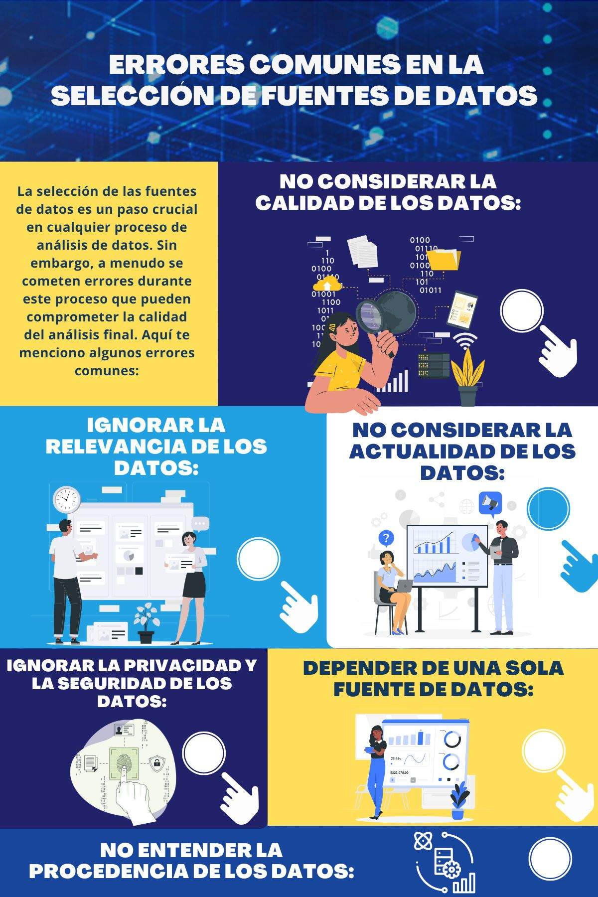
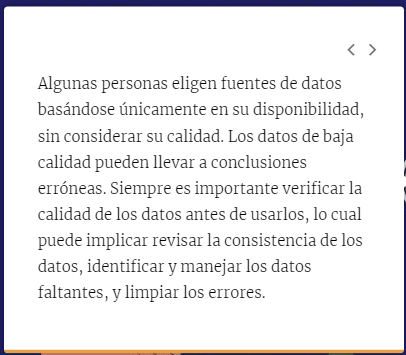
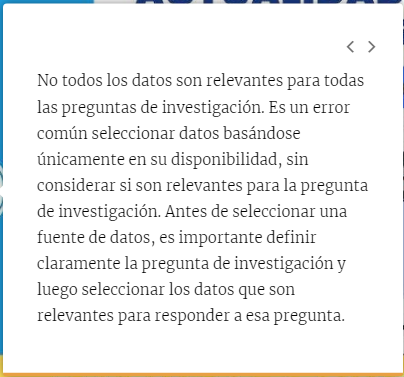
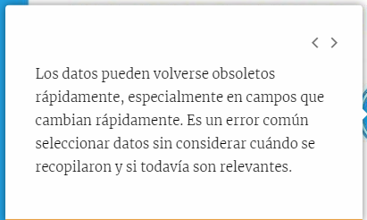
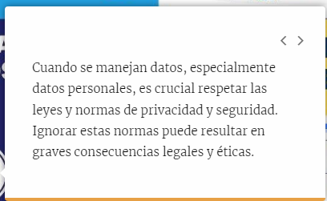
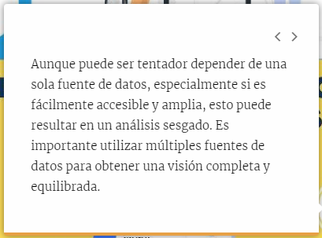

# Fuentes de datos, Recoleccion, Transformacion y Limpieza

## Introducción

Ver video 1_Introduccion

## Clasificaciones de las fuentes de datos

Ver video 2_fuentes de datos

## Importancia de las fuentes de datos

Ver pdf 3_importancia de las fuentes de datos

## Errores comunes en la selección de fuentes de datos

## Técnicas de recolección de datos

ver video 4_Técnicas de recolección de datos

## Proceso de recolección y preparación de datos

ver pdf 5_Preceso de recoleccion de datos

## Software y plataformas de encuestas

## Tipos de datos

## Tipos de fuentes de datos

## Limpieza y transformación de datos

## Ciclo analitica limpieza y tipos de datos

## Limpieza de Datos

## Herramientas y técnicas para la limpieza y transformación

## Herramientas más populares

## Ejemplo para la transformación de datos

## Lección 16 - Ejemplo para la transformación de datos
