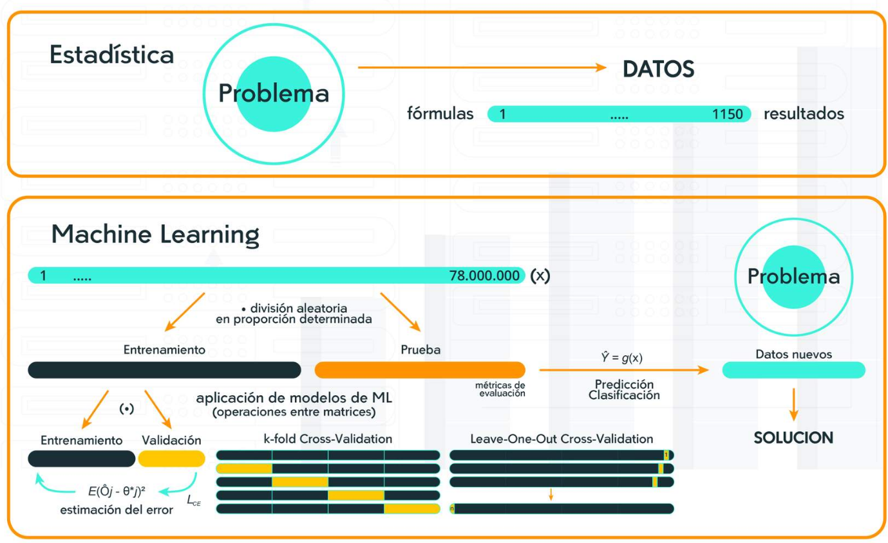

# Unidad 4 Aplicaciones de la analitica de datos

## Introducción

Ver video 1_Bienvenida

## Analisis completo

Ver video 2_Analisis completo

## Analítica de datos en el ámbito empresarial

La analítica de datos ha emergido como una disciplina esencial en el ámbito empresarial, transformando la forma en que las
organizaciones toman decisiones y abordan sus desafíos operativos. En este contexto, el análisis de datos ha ganado
prominencia en diversas áreas funcionales de las empresas, incluyendo el marketing, las operaciones y la gestión de recursos
humanos. Esta introducción explora la creciente relevancia de la analítica de datos en estos tres dominios empresariales y
cómo su aplicación estratégica puede impulsar la eficiencia, el rendimiento y la toma de decisiones informadas.

Paso 1 Analítica de Datos en Marketing

El marketing ha sido uno de los ámbitos donde la analítica de datos ha tenido un impacto significativo. La recopilación y
análisis de datos sobre el comportamiento de los clientes, las preferencias y las interacciones con la marca proporcionan
información valiosa para comprender el mercado objetivo y ajustar las estrategias de marketing. La segmentación de clientes
basada en datos permite una personalización más efectiva de mensajes y ofertas, aumentando la relevancia y la efectividad de
las campañas de marketing. Además, la analítica de datos ayuda a medir el retorno de inversión (ROI) de las iniciativas de
marketing y a optimizar el presupuesto publicitario para maximizar el impacto.

Paso 2 Analítica de Datos en Operaciones

En el ámbito de las operaciones empresariales, la analítica de datos juega un papel crucial en la mejora de la eficiencia y
la productividad. Mediante el análisis de datos relacionados con el rendimiento y la utilización de recursos, las empresas
pueden identificar áreas de mejora en sus procesos y operaciones. La analítica de datos también es útil en la gestión de la
cadena de suministro, permitiendo una mayor visibilidad y coordinación en la entrega de productos y servicios. La
optimización de inventario y la predicción de la demanda son áreas donde el análisis de datos puede marcar la diferencia,
reduciendo costos y mejorando la satisfacción del cliente.

Paso 3 Analítica de Datos en Recursos Humanos

En el área de recursos humanos, la analítica de datos se ha convertido en un poderoso recurso para la gestión del talento y
la toma de decisiones estratégicas en la contratación y retención de empleados. El análisis de datos puede ayudar a
identificar tendencias de rotación de personal, evaluar el rendimiento y la productividad de los empleados, y desarrollar
estrategias para mejorar la satisfacción y el compromiso del personal. Además, la analítica de datos en recursos humanos
puede ser utilizada para crear perfiles de talento, identificar habilidades clave y anticipar las necesidades futuras de la
fuerza laboral.

Paso 4 Desafíos y Consideraciones Éticas

A pesar de los beneficios de la analítica de datos en el ámbito empresarial, también existen desafíos y consideraciones
éticas a tener en cuenta. La calidad y confiabilidad de los datos son fundamentales para obtener resultados precisos y
significativos. Los analistas de datos deben abordar cuestiones de privacidad y seguridad, garantizando que los datos se
utilicen de manera ética y respetuosa. Además, es importante evitar sesgos y garantizar que los algoritmos utilizados en el
análisis sean transparentes y equitativos.

Paso 5 La Evolución de la Analítica de Datos en el Ámbito Empresarial

En las últimas décadas, la analítica de datos ha experimentado una evolución significativa en el ámbito empresarial.
Anteriormente, las decisiones se basaban principalmente en la intuición y la experiencia de los líderes de la organización.
Sin embargo, con los avances tecnológicos y la disponibilidad de grandes volúmenes de datos, la analítica se ha convertido
en una disciplina clave para abordar desafíos empresariales complejos.

La adopción de sistemas de gestión de bases de datos, tecnologías de almacenamiento en la nube y herramientas de análisis de
datos ha permitido a las empresas recopilar y procesar grandes cantidades de información de manera más rápida y eficiente.
Esto ha llevado al surgimiento del concepto de "big data", que se refiere a la gestión y análisis de datos a gran escala
para extraer información valiosa.

**Beneficios de la Analítica de Datos en el Ámbito Empresarial.**

La implementación exitosa de la analítica de datos en el ámbito empresarial conlleva una serie de beneficios significativos:

La analítica de datos proporciona información basada en evidencia, lo que permite a los líderes empresariales tomar
decisiones más informadas y estratégicas. Los datos respaldan la selección de estrategias efectivas y permiten una rápida
adaptación a cambios en el mercado o el entorno empresarial.

Al analizar los procesos internos y operativos, las empresas pueden identificar ineficiencias y áreas de mejora. La
optimización de recursos y la automatización de tareas redundantes aumentan la eficiencia y reducen costos.

La analítica de datos puede revelar oportunidades ocultas o nichos de mercado que no habían sido previamente considerados.
Esto permite a las empresas expandirse y diversificar sus ofertas, aumentando su competitividad.

Mediante el análisis de datos sobre el comportamiento del cliente, las empresas pueden personalizar sus productos y
servicios para satisfacer las necesidades específicas de cada cliente. Esto mejora la experiencia del cliente y fomenta la
lealtad a la marca.

**Desafíos y Barreras en la Implementación de la Analítica de Datos:**

A pesar de los beneficios, la implementación efectiva de la analítica de datos en el ámbito empresarial también enfrenta
desafíos y barreras. Algunos de estos desafíos incluyen:

La gran cantidad de datos disponibles puede ser abrumadora, y la calidad y limpieza de los datos pueden ser problemáticas.
Los analistas de datos deben lidiar con datos desestructurados y ruidosos, lo que puede dificultar el proceso de análisis.

La analítica de datos requiere habilidades técnicas y conocimientos especializados. La escasez de profesionales con
experiencia en análisis de datos puede ser un obstáculo para algunas organizaciones.

La implementación exitosa de la analítica de datos requiere una inversión en tecnología y herramientas adecuadas. Esto puede
representar un desafío para empresas más pequeñas o con recursos limitados.

**La Analítica de Datos como Ventaja Competitiva.**

En la actualidad, la analítica de datos se ha convertido en una ventaja competitiva para las empresas que saben aprovechar
su potencial. Aquellas organizaciones que utilizan de manera efectiva los datos para informar sus decisiones y estrategias
tienen una mayor capacidad para anticipar cambios en el mercado, adaptarse rápidamente a las demandas del cliente y mantener
una posición sólida frente a la competencia.

La analítica de datos ha demostrado ser una herramienta poderosa en el ámbito empresarial, particularmente en áreas como
marketing, operaciones y recursos humanos. Su adopción permite a las empresas tomar decisiones informadas, mejorar la
eficiencia, identificar oportunidades de negocio y mejorar la experiencia del cliente. Sin embargo, también presenta
desafíos en términos de complejidad de los datos, falta de habilidades y la necesidad de invertir en tecnología adecuada.
Aquellas organizaciones que superen estos desafíos y adopten una cultura de análisis de datos estarán mejor posicionadas
para aprovechar la analítica como una ventaja competitiva y avanzar hacia el éxito empresarial en un entorno cada vez más
competitivo y dinámico.

## Complemento: Analítica de datos en el ámbito empresarial

Ver pdf 3_Analitica de datos en el ambito empresarial

## Avance: Analítica de datos en el ámbito empresarial

Ver video 4_Analitica de datos en el ambito empresarial

## Analítica de datos en la salud

La analítica de datos ha emergido como una disciplina transformadora en el campo de la salud, revolucionando la forma en que
se abordan el diagnóstico y la predicción de enfermedades. Con el crecimiento exponencial en la disponibilidad de datos
médicos, avances tecnológicos y el desarrollo de algoritmos sofisticados, la analítica de datos ha demostrado su capacidad
para mejorar la precisión y eficiencia de los procesos médicos, lo que puede tener un impacto significativo en la atención
al paciente y la toma de decisiones médicas.

Paso 1

El diagnóstico médico es un proceso crítico en la atención de la salud, y la analítica de datos ha allanado el camino para
mejorar la precisión y rapidez en este aspecto. Mediante el análisis de grandes conjuntos de datos, como imágenes médicas,
datos de laboratorio, historia clínica del paciente y otros parámetros, los algoritmos de aprendizaje automático pueden
detectar patrones y anomalías que pueden escapar a la observación humana. Esto facilita la identificación temprana de
enfermedades y condiciones médicas, lo que conduce a tratamientos más efectivos y una mejor gestión de la salud del
paciente.

Paso 1

El diagnóstico médico es un proceso crítico en la atención de la salud, y la analítica de datos ha allanado el camino para
mejorar la precisión y rapidez en este aspecto. Mediante el análisis de grandes conjuntos de datos, como imágenes médicas,
datos de laboratorio, historia clínica del paciente y otros parámetros, los algoritmos de aprendizaje automático pueden
detectar patrones y anomalías que pueden escapar a la observación humana. Esto facilita la identificación temprana de
enfermedades y condiciones médicas, lo que conduce a tratamientos más efectivos y una mejor gestión de la salud del
paciente.

Paso 2

La analítica de datos también ha demostrado su capacidad para predecir enfermedades y evaluar el riesgo de desarrollar
ciertas condiciones médicas. Mediante el análisis de datos históricos de pacientes y la identificación de factores de
riesgo, se pueden crear modelos predictivos que ayuden a los profesionales de la salud a tomar decisiones proactivas para
prevenir enfermedades o brindar tratamientos preventivos. Esto es especialmente relevante en el manejo de enfermedades
crónicas, donde la predicción y el manejo temprano pueden mejorar la calidad de vida del paciente y reducir los costos
asociados a la atención médica.

Paso 3

La analítica de datos también se ha aplicado con éxito para optimizar los recursos y mejorar la eficiencia en la atención
médica. Mediante el análisis de flujos de pacientes, patrones de demanda y recursos disponibles, se pueden identificar
oportunidades para mejorar los tiempos de espera, la asignación de personal y el uso de equipos médicos. Esto no solo
beneficia a los pacientes al reducir los tiempos de espera, sino que también puede ayudar a los proveedores de atención
médica a maximizar el uso de recursos limitados y mejorar la productividad general del sistema de salud.

Paso 4

A pesar de los beneficios, la implementación de la analítica de datos en el ámbito de la salud enfrenta desafíos y
consideraciones éticas. La privacidad y seguridad de los datos del paciente son fundamentales y deben ser protegidas en todo
momento. Los profesionales de la salud y los analistas de datos deben cumplir con las regulaciones y estándares de
privacidad, y garantizar el anonimato adecuado de los datos sensibles.

Además, la interpretación y toma de decisiones basadas en modelos predictivos también conlleva riesgos. Los algoritmos de
aprendizaje automático pueden ser tan buenos como los datos en los que se entrenan, y es fundamental abordar sesgos o
desigualdades en los datos para evitar resultados injustos o discriminativos.

Paso 5

El futuro de la analítica de datos en la salud se muestra prometedor, con continuas innovaciones que están transformando la
forma en que se abordan los desafíos médicos.

**Algunas de las tendencias emergentes incluyen:**

Medicina personalizada: La analítica de datos está allanando el camino para la medicina personalizada, donde los
tratamientos se adaptan a las características genéticas y específicas de cada paciente. Los análisis genómicos y la
integración de datos de salud personalizados permiten a los médicos prescribir tratamientos más precisos y efectivos.

Inteligencia artificial en diagnostico: La inteligencia artificial (IA) y el aprendizaje profundo están impulsando avances
en el diagnóstico médico. Los algoritmos de IA pueden analizar grandes volúmenes de datos de pacientes y radiografías para
detectar patrones y anomalías, lo que ayuda a los médicos a tomar decisiones más rápidas y precisas.

Prediccion de brotes y epidemiologia: La analítica de datos se ha vuelto invaluable en la predicción y gestión de brotes de
enfermedades. Los modelos predictivos pueden analizar datos epidemiológicos y de vigilancia para anticipar la propagación de
enfermedades y facilitar una respuesta rápida y efectiva.

Analisis de datos en diispositivos medicos: Los dispositivos médicos conectados y las aplicaciones de salud están generando
grandes cantidades de datos sobre el bienestar de los pacientes. La analítica de datos en tiempo real permite el monitoreo
continuo y la detección temprana de cambios en la salud, lo que es especialmente útil en el manejo de enfermedades crónicas.

**Colaboracion y etica en la analitica de datos en salud:**

Paso 1

La analítica de datos en la salud requiere una colaboración efectiva entre profesionales de la salud, analistas de datos y
expertos en ética. Es fundamental garantizar la calidad y fiabilidad de los datos, y abordar de manera proactiva los
desafíos éticos y de privacidad. La transparencia y el consentimiento informado de los pacientes son esenciales en la
recopilación y uso de datos médicos.

Paso 2

Además, es crucial mantener un enfoque centrado en el paciente en todo momento. La analítica de datos debe estar destinada a
mejorar los resultados para los pacientes, proporcionando una atención más personalizada y eficiente.

La analítica de datos en la salud ha revolucionado la forma en que se diagnostican y pronostican enfermedades. La capacidad
de analizar grandes volúmenes de datos médicos ha mejorado la precisión y eficiencia en el diagnóstico, así como la
capacidad de predecir y prevenir enfermedades. A medida que avanzamos hacia el futuro, las innovaciones en inteligencia
artificial, medicina personalizada y dispositivos médicos conectados seguirán impulsando el potencial de la analítica de
datos en la salud.

Paso 3

Es esencial abordar los desafíos éticos y de privacidad, asegurando que la analítica de datos se implemente de manera
responsable y se enfoque en mejorar los resultados para los pacientes. Con una colaboración efectiva entre profesionales de
la salud y analistas de datos, y un enfoque centrado en el paciente, la analítica de datos en la salud tiene el potencial de
continuar transformando la atención médica y brindando beneficios significativos para la sociedad en general.

## Complemento: Analítica de datos en la salud

Ver pdf 5_Analítica de datos en la salud

## Avance: Analítica de datos en la salud

ver video 6_Analítica de datos en la salud

## Profundización: Analítica de datos en la salud

## Analítica de datos en la industria financiera

Ver video 7_Analítica de datos en la industria financiera

## Complemento: Analítica de datos en la industria financiera

Ver pdf 8_Analítica de datos en la industria financiera

## Profundización: Analítica de datos en la industria financiera

ver video 9_Analítica de datos en la industria financiera

## Analítica de datos en el sector público|

La analítica de datos ha emergido como una herramienta poderosa y transformadora en el sector público, impactando significativamente la formulación de políticas públicas y la optimización de recursos en las administraciones gubernamentales. En esta introducción, exploraremos cómo la aplicación de técnicas analíticas avanzadas y el uso efectivo de datos han revolucionado la forma en que los gobiernos toman decisiones estratégicas y operativas, mejorando la eficiencia en la prestación de servicios y el bienestar de los ciudadanos

**Analisis basado e evidencias prar politica publica:**

## Complemento: Analítica de datos en el sector público

## Profundización: Analítica de datos en el sector público

## Ética y privacidad en la analítica de datos

## Complemento: Ética y privacidad en la analítica de datos

## Avance: Ética y privacidad en la analítica de datos_

## Kaggle herramienta adicional
