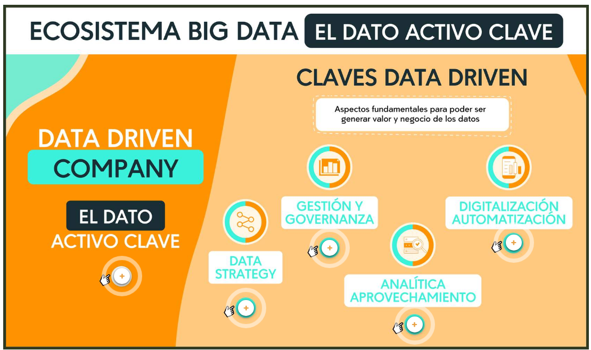

# Unidad 4 Aplicaciones de la analitica de datos

## Introducción

Ver video 1_Bienvenida

## Analisis completo

Ver video 2_Analisis completo

## Analítica de datos en el ámbito empresarial

La analítica de datos ha emergido como una disciplina esencial en el ámbito empresarial, transformando la forma en que las
organizaciones toman decisiones y abordan sus desafíos operativos. En este contexto, el análisis de datos ha ganado
prominencia en diversas áreas funcionales de las empresas, incluyendo el marketing, las operaciones y la gestión de recursos
humanos. Esta introducción explora la creciente relevancia de la analítica de datos en estos tres dominios empresariales y
cómo su aplicación estratégica puede impulsar la eficiencia, el rendimiento y la toma de decisiones informadas.

Paso 1 Analítica de Datos en Marketing

El marketing ha sido uno de los ámbitos donde la analítica de datos ha tenido un impacto significativo. La recopilación y
análisis de datos sobre el comportamiento de los clientes, las preferencias y las interacciones con la marca proporcionan
información valiosa para comprender el mercado objetivo y ajustar las estrategias de marketing. La segmentación de clientes
basada en datos permite una personalización más efectiva de mensajes y ofertas, aumentando la relevancia y la efectividad de
las campañas de marketing. Además, la analítica de datos ayuda a medir el retorno de inversión (ROI) de las iniciativas de
marketing y a optimizar el presupuesto publicitario para maximizar el impacto.

Paso 2 Analítica de Datos en Operaciones

En el ámbito de las operaciones empresariales, la analítica de datos juega un papel crucial en la mejora de la eficiencia y
la productividad. Mediante el análisis de datos relacionados con el rendimiento y la utilización de recursos, las empresas
pueden identificar áreas de mejora en sus procesos y operaciones. La analítica de datos también es útil en la gestión de la
cadena de suministro, permitiendo una mayor visibilidad y coordinación en la entrega de productos y servicios. La
optimización de inventario y la predicción de la demanda son áreas donde el análisis de datos puede marcar la diferencia,
reduciendo costos y mejorando la satisfacción del cliente.

Paso 3 Analítica de Datos en Recursos Humanos

En el área de recursos humanos, la analítica de datos se ha convertido en un poderoso recurso para la gestión del talento y
la toma de decisiones estratégicas en la contratación y retención de empleados. El análisis de datos puede ayudar a
identificar tendencias de rotación de personal, evaluar el rendimiento y la productividad de los empleados, y desarrollar
estrategias para mejorar la satisfacción y el compromiso del personal. Además, la analítica de datos en recursos humanos
puede ser utilizada para crear perfiles de talento, identificar habilidades clave y anticipar las necesidades futuras de la
fuerza laboral.

Paso 4 Desafíos y Consideraciones Éticas

A pesar de los beneficios de la analítica de datos en el ámbito empresarial, también existen desafíos y consideraciones
éticas a tener en cuenta. La calidad y confiabilidad de los datos son fundamentales para obtener resultados precisos y
significativos. Los analistas de datos deben abordar cuestiones de privacidad y seguridad, garantizando que los datos se
utilicen de manera ética y respetuosa. Además, es importante evitar sesgos y garantizar que los algoritmos utilizados en el
análisis sean transparentes y equitativos.

Paso 5 La Evolución de la Analítica de Datos en el Ámbito Empresarial

En las últimas décadas, la analítica de datos ha experimentado una evolución significativa en el ámbito empresarial.
Anteriormente, las decisiones se basaban principalmente en la intuición y la experiencia de los líderes de la organización.
Sin embargo, con los avances tecnológicos y la disponibilidad de grandes volúmenes de datos, la analítica se ha convertido
en una disciplina clave para abordar desafíos empresariales complejos.

La adopción de sistemas de gestión de bases de datos, tecnologías de almacenamiento en la nube y herramientas de análisis de
datos ha permitido a las empresas recopilar y procesar grandes cantidades de información de manera más rápida y eficiente.
Esto ha llevado al surgimiento del concepto de "big data", que se refiere a la gestión y análisis de datos a gran escala
para extraer información valiosa.

**Beneficios de la Analítica de Datos en el Ámbito Empresarial.**

La implementación exitosa de la analítica de datos en el ámbito empresarial conlleva una serie de beneficios significativos:

La analítica de datos proporciona información basada en evidencia, lo que permite a los líderes empresariales tomar
decisiones más informadas y estratégicas. Los datos respaldan la selección de estrategias efectivas y permiten una rápida
adaptación a cambios en el mercado o el entorno empresarial.

Al analizar los procesos internos y operativos, las empresas pueden identificar ineficiencias y áreas de mejora. La
optimización de recursos y la automatización de tareas redundantes aumentan la eficiencia y reducen costos.

La analítica de datos puede revelar oportunidades ocultas o nichos de mercado que no habían sido previamente considerados.
Esto permite a las empresas expandirse y diversificar sus ofertas, aumentando su competitividad.

Mediante el análisis de datos sobre el comportamiento del cliente, las empresas pueden personalizar sus productos y
servicios para satisfacer las necesidades específicas de cada cliente. Esto mejora la experiencia del cliente y fomenta la
lealtad a la marca.

**Desafíos y Barreras en la Implementación de la Analítica de Datos:**

A pesar de los beneficios, la implementación efectiva de la analítica de datos en el ámbito empresarial también enfrenta
desafíos y barreras. Algunos de estos desafíos incluyen:

La gran cantidad de datos disponibles puede ser abrumadora, y la calidad y limpieza de los datos pueden ser problemáticas.
Los analistas de datos deben lidiar con datos desestructurados y ruidosos, lo que puede dificultar el proceso de análisis.

La analítica de datos requiere habilidades técnicas y conocimientos especializados. La escasez de profesionales con
experiencia en análisis de datos puede ser un obstáculo para algunas organizaciones.

La implementación exitosa de la analítica de datos requiere una inversión en tecnología y herramientas adecuadas. Esto puede
representar un desafío para empresas más pequeñas o con recursos limitados.

**La Analítica de Datos como Ventaja Competitiva.**

En la actualidad, la analítica de datos se ha convertido en una ventaja competitiva para las empresas que saben aprovechar
su potencial. Aquellas organizaciones que utilizan de manera efectiva los datos para informar sus decisiones y estrategias
tienen una mayor capacidad para anticipar cambios en el mercado, adaptarse rápidamente a las demandas del cliente y mantener
una posición sólida frente a la competencia.

La analítica de datos ha demostrado ser una herramienta poderosa en el ámbito empresarial, particularmente en áreas como
marketing, operaciones y recursos humanos. Su adopción permite a las empresas tomar decisiones informadas, mejorar la
eficiencia, identificar oportunidades de negocio y mejorar la experiencia del cliente. Sin embargo, también presenta
desafíos en términos de complejidad de los datos, falta de habilidades y la necesidad de invertir en tecnología adecuada.
Aquellas organizaciones que superen estos desafíos y adopten una cultura de análisis de datos estarán mejor posicionadas
para aprovechar la analítica como una ventaja competitiva y avanzar hacia el éxito empresarial en un entorno cada vez más
competitivo y dinámico.

## Complemento: Analítica de datos en el ámbito empresarial

Ver pdf 3_Analitica de datos en el ambito empresarial

## Avance: Analítica de datos en el ámbito empresarial

Ver video 4_Analitica de datos en el ambito empresarial

## Analítica de datos en la salud

La analítica de datos ha emergido como una disciplina transformadora en el campo de la salud, revolucionando la forma en que
se abordan el diagnóstico y la predicción de enfermedades. Con el crecimiento exponencial en la disponibilidad de datos
médicos, avances tecnológicos y el desarrollo de algoritmos sofisticados, la analítica de datos ha demostrado su capacidad
para mejorar la precisión y eficiencia de los procesos médicos, lo que puede tener un impacto significativo en la atención
al paciente y la toma de decisiones médicas.

Paso 1

El diagnóstico médico es un proceso crítico en la atención de la salud, y la analítica de datos ha allanado el camino para
mejorar la precisión y rapidez en este aspecto. Mediante el análisis de grandes conjuntos de datos, como imágenes médicas,
datos de laboratorio, historia clínica del paciente y otros parámetros, los algoritmos de aprendizaje automático pueden
detectar patrones y anomalías que pueden escapar a la observación humana. Esto facilita la identificación temprana de
enfermedades y condiciones médicas, lo que conduce a tratamientos más efectivos y una mejor gestión de la salud del
paciente.

Paso 1

El diagnóstico médico es un proceso crítico en la atención de la salud, y la analítica de datos ha allanado el camino para
mejorar la precisión y rapidez en este aspecto. Mediante el análisis de grandes conjuntos de datos, como imágenes médicas,
datos de laboratorio, historia clínica del paciente y otros parámetros, los algoritmos de aprendizaje automático pueden
detectar patrones y anomalías que pueden escapar a la observación humana. Esto facilita la identificación temprana de
enfermedades y condiciones médicas, lo que conduce a tratamientos más efectivos y una mejor gestión de la salud del
paciente.

Paso 2

La analítica de datos también ha demostrado su capacidad para predecir enfermedades y evaluar el riesgo de desarrollar
ciertas condiciones médicas. Mediante el análisis de datos históricos de pacientes y la identificación de factores de
riesgo, se pueden crear modelos predictivos que ayuden a los profesionales de la salud a tomar decisiones proactivas para
prevenir enfermedades o brindar tratamientos preventivos. Esto es especialmente relevante en el manejo de enfermedades
crónicas, donde la predicción y el manejo temprano pueden mejorar la calidad de vida del paciente y reducir los costos
asociados a la atención médica.

Paso 3

La analítica de datos también se ha aplicado con éxito para optimizar los recursos y mejorar la eficiencia en la atención
médica. Mediante el análisis de flujos de pacientes, patrones de demanda y recursos disponibles, se pueden identificar
oportunidades para mejorar los tiempos de espera, la asignación de personal y el uso de equipos médicos. Esto no solo
beneficia a los pacientes al reducir los tiempos de espera, sino que también puede ayudar a los proveedores de atención
médica a maximizar el uso de recursos limitados y mejorar la productividad general del sistema de salud.

Paso 4

A pesar de los beneficios, la implementación de la analítica de datos en el ámbito de la salud enfrenta desafíos y
consideraciones éticas. La privacidad y seguridad de los datos del paciente son fundamentales y deben ser protegidas en todo
momento. Los profesionales de la salud y los analistas de datos deben cumplir con las regulaciones y estándares de
privacidad, y garantizar el anonimato adecuado de los datos sensibles.

Además, la interpretación y toma de decisiones basadas en modelos predictivos también conlleva riesgos. Los algoritmos de
aprendizaje automático pueden ser tan buenos como los datos en los que se entrenan, y es fundamental abordar sesgos o
desigualdades en los datos para evitar resultados injustos o discriminativos.

Paso 5

El futuro de la analítica de datos en la salud se muestra prometedor, con continuas innovaciones que están transformando la
forma en que se abordan los desafíos médicos.

**Algunas de las tendencias emergentes incluyen:**

Medicina personalizada: La analítica de datos está allanando el camino para la medicina personalizada, donde los
tratamientos se adaptan a las características genéticas y específicas de cada paciente. Los análisis genómicos y la
integración de datos de salud personalizados permiten a los médicos prescribir tratamientos más precisos y efectivos.

Inteligencia artificial en diagnostico: La inteligencia artificial (IA) y el aprendizaje profundo están impulsando avances
en el diagnóstico médico. Los algoritmos de IA pueden analizar grandes volúmenes de datos de pacientes y radiografías para
detectar patrones y anomalías, lo que ayuda a los médicos a tomar decisiones más rápidas y precisas.

Prediccion de brotes y epidemiologia: La analítica de datos se ha vuelto invaluable en la predicción y gestión de brotes de
enfermedades. Los modelos predictivos pueden analizar datos epidemiológicos y de vigilancia para anticipar la propagación de
enfermedades y facilitar una respuesta rápida y efectiva.

Analisis de datos en diispositivos medicos: Los dispositivos médicos conectados y las aplicaciones de salud están generando
grandes cantidades de datos sobre el bienestar de los pacientes. La analítica de datos en tiempo real permite el monitoreo
continuo y la detección temprana de cambios en la salud, lo que es especialmente útil en el manejo de enfermedades crónicas.

**Colaboracion y etica en la analitica de datos en salud:**

Paso 1

La analítica de datos en la salud requiere una colaboración efectiva entre profesionales de la salud, analistas de datos y
expertos en ética. Es fundamental garantizar la calidad y fiabilidad de los datos, y abordar de manera proactiva los
desafíos éticos y de privacidad. La transparencia y el consentimiento informado de los pacientes son esenciales en la
recopilación y uso de datos médicos.

Paso 2

Además, es crucial mantener un enfoque centrado en el paciente en todo momento. La analítica de datos debe estar destinada a
mejorar los resultados para los pacientes, proporcionando una atención más personalizada y eficiente.

La analítica de datos en la salud ha revolucionado la forma en que se diagnostican y pronostican enfermedades. La capacidad
de analizar grandes volúmenes de datos médicos ha mejorado la precisión y eficiencia en el diagnóstico, así como la
capacidad de predecir y prevenir enfermedades. A medida que avanzamos hacia el futuro, las innovaciones en inteligencia
artificial, medicina personalizada y dispositivos médicos conectados seguirán impulsando el potencial de la analítica de
datos en la salud.

Paso 3

Es esencial abordar los desafíos éticos y de privacidad, asegurando que la analítica de datos se implemente de manera
responsable y se enfoque en mejorar los resultados para los pacientes. Con una colaboración efectiva entre profesionales de
la salud y analistas de datos, y un enfoque centrado en el paciente, la analítica de datos en la salud tiene el potencial de
continuar transformando la atención médica y brindando beneficios significativos para la sociedad en general.

## Complemento: Analítica de datos en la salud

Ver pdf 5_Analítica de datos en la salud

## Avance: Analítica de datos en la salud

ver video 6_Analítica de datos en la salud

## Profundización: Analítica de datos en la salud

## Analítica de datos en la industria financiera

Ver video 7_Analítica de datos en la industria financiera

## Complemento: Analítica de datos en la industria financiera

Ver pdf 8_Analítica de datos en la industria financiera

## Profundización: Analítica de datos en la industria financiera

ver video 9_Analítica de datos en la industria financiera

## Analítica de datos en el sector público|

La analítica de datos ha emergido como una herramienta poderosa y transformadora en el sector público, impactando
significativamente la formulación de políticas públicas y la optimización de recursos en las administraciones
gubernamentales. En esta introducción, exploraremos cómo la aplicación de técnicas analíticas avanzadas y el uso efectivo de
datos han revolucionado la forma en que los gobiernos toman decisiones estratégicas y operativas, mejorando la eficiencia en
la prestación de servicios y el bienestar de los ciudadanos

**Analisis basado e evidencias prar politica publica:**

La analítica de datos ha revolucionado la toma de decisiones en el sector público al proporcionar un enfoque basado en
evidencia para la formulación de políticas. Al analizar grandes volúmenes de datos gubernamentales, sociales y económicos,
los analistas de datos pueden identificar patrones y tendencias que ayudan a los responsables políticos a comprender mejor
los desafíos sociales y económicos que enfrentan sus comunidades.

La utilización de datos en la toma de decisiones políticas permite que las políticas sean más objetivas, eficaces y
adecuadas a las necesidades específicas de la población. Esto permite una asignación más precisa de recursos y una
evaluación rigurosa del impacto de las políticas implementadas.

**optimizacion de recursos:**

La analítica de datos ha sido fundamental en la optimización de recursos en el sector público. Mediante el análisis de datos
sobre gastos gubernamentales, uso de servicios públicos y rendimiento de programas, los gobiernos pueden identificar
oportunidades para reducir costos, mejorar la eficiencia y garantizar una distribución equitativa de los recursos.

La optimización de recursos también implica una mejor planificación y coordinación de servicios públicos, como salud,
educación y transporte. Al analizar datos demográficos y geoespaciales, los gobiernos pueden diseñar estrategias para
satisfacer las necesidades de la población de manera más efectiva y mejorar la calidad de vida de los ciudadanos.

**Mejora de la transparecia y participacion ciudadana:**

La analítica de datos también ha mejorado la transparencia y participación ciudadana en el sector público. Mediante el
acceso a datos gubernamentales, los ciudadanos pueden obtener una visión más clara de las políticas implementadas, el
desempeño del gobierno y el uso de recursos públicos.

Además, la analítica de datos permite la creación de plataformas interactivas y aplicaciones que facilitan la participación
ciudadana en la toma de decisiones gubernamentales. Los ciudadanos pueden proporcionar comentarios, expresar preocupaciones
y contribuir a la formulación de políticas públicas a través de mecanismos basados en datos.

**Desafios y consideraciones eticas:**

A pesar de los beneficios, la implementación de la analítica de datos en el sector público enfrenta desafíos y
consideraciones éticas. La privacidad y seguridad de los datos de los ciudadanos son fundamentales y deben ser protegidas en
todo momento. Los gobiernos deben garantizar que la recopilación, almacenamiento y uso de datos se realicen de manera ética
y cumpliendo con las regulaciones de protección de datos.

Además, los sesgos en los datos y algoritmos también son preocupaciones importantes. Es esencial abordar los sesgos para
evitar decisiones discriminatorias o injustas en la formulación de políticas y la prestación de servicios públicos.

**Innovaciones futuras en la analitica de datos en el sector publico:**

El futuro de la analítica de datos en el sector público se muestra prometedor, con continuas innovaciones que pueden
transformar aún más la forma en que los gobiernos abordan los desafíos y satisfacen las necesidades de los ciudadanos.

**Tendencias emergentes:**

La inteligencia artificial y el procesamiento de lenguaje natural serán fundamentales en el análisis y comprensión de
grandes conjuntos de datos no estructurados, como informes gubernamentales, comentarios ciudadanos y noticias. Esto
permitirá una mayor automatización de tareas analíticas y una identificación más precisa de patrones y tendencias.

La analítica de datos avanzada permitirá a los gobiernos predecir tendencias a largo plazo y evaluar el impacto de políticas
futuras. Los modelos predictivos ayudarán a los responsables políticos a tomar decisiones más informadas y a planificar
estrategias a largo plazo para abordar desafíos económicos, sociales y ambientales.

La analítica de datos será fundamental en el desarrollo de gobiernos digitales y plataformas interactivas que fomenten una
mayor participación ciudadana. El uso de datos en tiempo real y análisis predictivos permitirá que los ciudadanos accedan a
información actualizada y contribuyan activamente en la toma de decisiones.

La analítica de datos facilitará la preservación y acceso a datos históricos, lo que permitirá a los gobiernos realizar
evaluaciones retrospectivas de políticas implementadas en el pasado. Esto ayudará a aprender de experiencias pasadas y
mejorar la efectividad de las políticas futuras.

**Colaboracion y seguridad de datos:**

Paso 1

La implementación exitosa de la analítica de datos en el sector público requerirá una colaboración efectiva entre expertos
en análisis de datos, profesionales gubernamentales y ciudadanos. La colaboración garantizará que los datos se utilicen de
manera ética y responsable para el beneficio de la sociedad en general.

Además, la seguridad de los datos será una prioridad clave. Los gobiernos deben garantizar la protección de datos personales
y gubernamentales, implementando medidas de seguridad robustas y cumpliendo con los estándares de privacidad.

Paso 2

La analítica de datos ha tenido un impacto significativo en el sector público al proporcionar un enfoque basado en evidencia
para la formulación de políticas y la optimización de recursos. La toma de decisiones informadas y la mejora de la
eficiencia en la prestación de servicios públicos son solo algunos ejemplos de cómo la analítica de datos ha transformado la
forma en que los gobiernos abordan los desafíos y satisfacen las necesidades de los ciudadanos.

Paso 3

El futuro de la analítica de datos en el sector público se ve prometedor, con innovaciones emergentes que pueden llevar a
una mayor automatización, análisis predictivo y participación ciudadana. Sin embargo, es fundamental abordar los desafíos de
privacidad, seguridad y sesgos para garantizar una implementación ética y efectiva de la analítica de datos.

Con una colaboración efectiva y un enfoque centrado en la mejora continua, la analítica de datos seguirá siendo una
herramienta valiosa para los gobiernos en la toma de decisiones estratégicas y operativas, brindando beneficios tanto a los
gobiernos como a los ciudadanos y contribuyendo a un mejor bienestar y calidad de vida para la sociedad en su conjunto

## Complemento: Analítica de datos en el sector público

Ver pdf 10_Analítica de datos en el sector público

## Profundización: Analítica de datos en el sector público

## Ética y privacidad en la analítica de datos

La analítica de datos ha emergido como una herramienta poderosa en la toma de decisiones estratégicas y operativas en una
amplia gama de sectores, incluyendo negocios, gobierno, salud y más. Al permitir el análisis y procesamiento de grandes
volúmenes de datos, la analítica de datos ofrece una comprensión profunda de patrones, tendencias y comportamientos que
antes eran difíciles de alcanzar. Sin embargo, junto con los beneficios que aporta la analítica de datos, surgen cuestiones
éticas y de privacidad que deben abordarse de manera proactiva y responsable.

La ética en la analítica de datos se refiere a la consideración de cuestiones morales y valores humanos en la recopilación,
almacenamiento, análisis y uso de datos. A medida que la analítica de datos se vuelve más omnipresente, es fundamental
reflexionar sobre cómo se están utilizando los datos y cuáles son las implicaciones éticas de dichos usos.

Uno de los principales desafíos éticos es el equilibrio entre el bien común y el respeto a los derechos individuales. La
toma de decisiones basada en datos puede tener un impacto significativo en la vida de las personas y en la sociedad en su
conjunto. Por lo tanto, es esencial que los analistas de datos consideren las implicaciones éticas de sus acciones y se
aseguren de que los resultados benefician a la sociedad de manera justa y equitativa.

Paso 2

La privacidad y protección de datos son cuestiones críticas en la analítica de datos. La recopilación y uso de datos
personales pueden ser invasivos y violar la privacidad de las personas. Los analistas de datos deben garantizar que se
cumplan las regulaciones y normativas de privacidad de datos, y que los datos personales se utilicen de manera segura y
responsable.

La anonimización y el cifrado de datos son estrategias importantes para proteger la privacidad de los individuos. Al
anonimizar los datos, se eliminan o modifican las identidades de las personas para que no puedan ser identificadas. El
cifrado asegura que los datos estén protegidos durante su transmisión y almacenamiento, lo que reduce el riesgo de violación
de datos y acceso no autorizado.

Paso 3

Los sesgos en los modelos analíticos son otra cuestión ética importante. Los sesgos pueden surgir de datos incompletos,
sesgados o poco representativos, lo que puede llevar a decisiones discriminatorias o injustas. Los analistas de datos deben
ser conscientes de los sesgos y trabajar para mitigarlos en sus modelos analíticos.

Además, la discriminación puede surgir cuando los modelos analíticos toman decisiones basadas en características sensibles
de las personas, como género, raza o religión. Es importante que los modelos analíticos sean justos y no perpetúen
prejuicios o desigualdades existentes.

Paso 4

La transparencia y responsabilidad son principios fundamentales en la ética de la analítica de datos. Los analistas de datos
deben ser transparentes sobre cómo se recopilan, utilizan y analizan los datos. Los ciudadanos y clientes deben estar
informados sobre el propósito de la recopilación de datos y dar su consentimiento informado para su uso.

Además, los analistas de datos deben asumir la responsabilidad de sus decisiones y resultados. Esto implica ser conscientes
de las posibles consecuencias de sus análisis y estar dispuestos a corregir errores o malentendidos que puedan surgir.

Paso 5

La ética y privacidad en la analítica de datos también están estrechamente relacionadas con el marco legal y regulatorio que
rige el uso de datos en diferentes jurisdicciones. Los gobiernos y las organizaciones deben cumplir con leyes y regulaciones
relacionadas con la privacidad de datos, protección al consumidor y derechos individuales.

En muchos países, existen leyes específicas de privacidad de datos, como el Reglamento General de Protección de Datos (RGPD)
en la Unión Europea o la Ley de Privacidad del Consumidor de California (CCPA) en los Estados Unidos. Estas leyes establecen
requisitos claros sobre cómo las organizaciones pueden recopilar, utilizar y compartir datos personales, así como las
medidas que deben tomar para garantizar la seguridad y privacidad de los datos.

Los analistas de datos deben tener un profundo conocimiento de estas leyes y regulaciones y asegurarse de que sus prácticas
de análisis de datos cumplan con los estándares legales y éticos establecidos.

Paso 6

La ética y privacidad en la analítica de datos también dependen en gran medida de la educación y conciencia de los
profesionales involucrados en el análisis de datos. Los analistas de datos deben recibir una capacitación adecuada sobre
cuestiones éticas y privacidad de datos, así como sobre la importancia de la responsabilidad en sus acciones.

Además, las organizaciones deben promover una cultura ética que fomente la toma de decisiones basadas en valores y
principios. La ética en la analítica de datos debe ser una parte integral de la cultura corporativa y ser respaldada por los
líderes y gerentes de la organización.

Paso 7

La ética en la analítica de datos se beneficia enormemente de la colaboración entre profesionales de datos y expertos en
ética y privacidad. La colaboración multidisciplinaria puede ayudar a identificar y abordar problemas éticos de manera más
efectiva, asegurando que las decisiones tomadas en el análisis de datos sean justas, equitativas y respetuosas de los
derechos individuales.

Los expertos en ética pueden proporcionar una perspectiva crítica en el proceso de análisis de datos, cuestionando posibles
sesgos y discriminación y garantizando que las decisiones estén alineadas con los valores fundamentales de la sociedad.

Paso 8

La ética y privacidad en la analítica de datos son consideraciones críticas para garantizar que el análisis de datos
beneficie a la sociedad de manera justa y equitativa, protegiendo la privacidad y derechos individuales. Los analistas de
datos deben ser conscientes de las implicaciones éticas de sus acciones y tomar decisiones informadas y responsables.

La transparencia, responsabilidad, mitigación de sesgos y cumplimiento legal son pilares fundamentales para una
implementación ética y efectiva de la analítica de datos. La colaboración entre profesionales de datos y expertos en ética
también es esencial para abordar de manera efectiva los desafíos éticos y promover una cultura ética en el análisis de
datos.

Paso 9

Con un enfoque ético y responsable, la analítica de datos puede seguir siendo una herramienta valiosa para mejorar la toma
de decisiones, impulsar la innovación y promover el bienestar y progreso de la sociedad en su conjunto. Al mantener un
equilibrio adecuado entre la utilidad de los datos y la protección de los derechos individuales, la analítica de datos puede
alcanzar su máximo potencial como una fuerza positiva para el beneficio de la humanidad.

## Complemento: Ética y privacidad en la analítica de datos

## Avance: Ética y privacidad en la analítica de datos_

## Kaggle herramienta adicional
